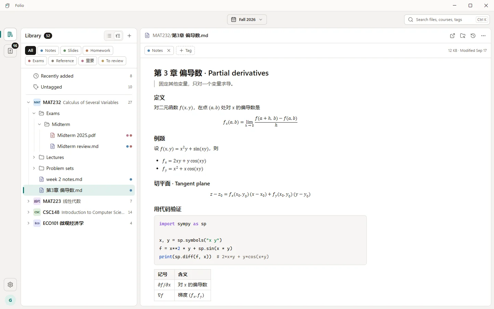
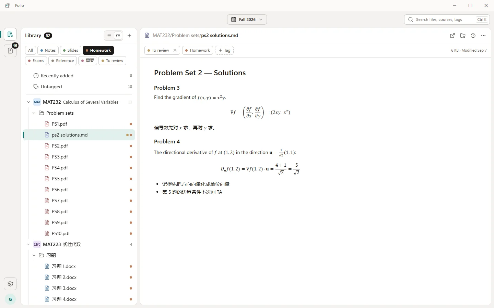
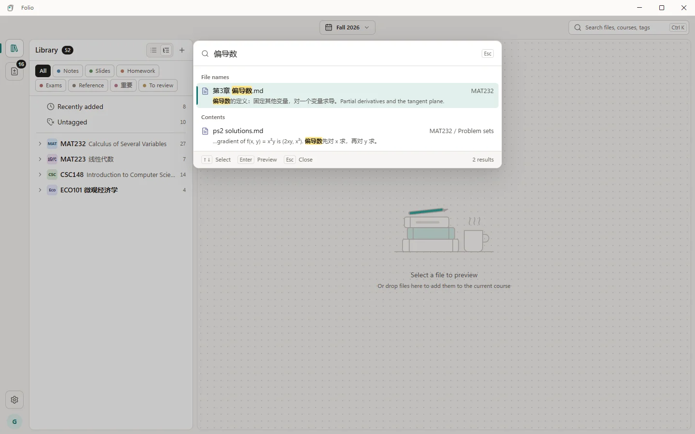
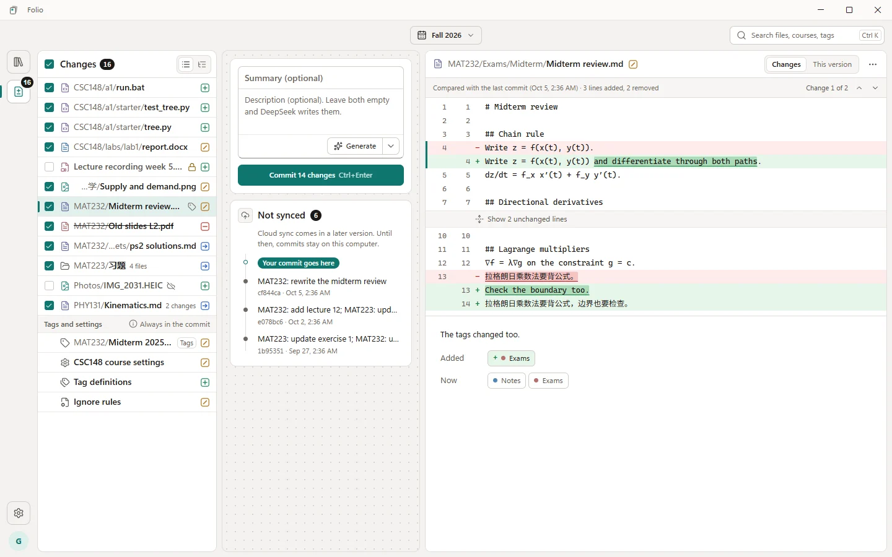
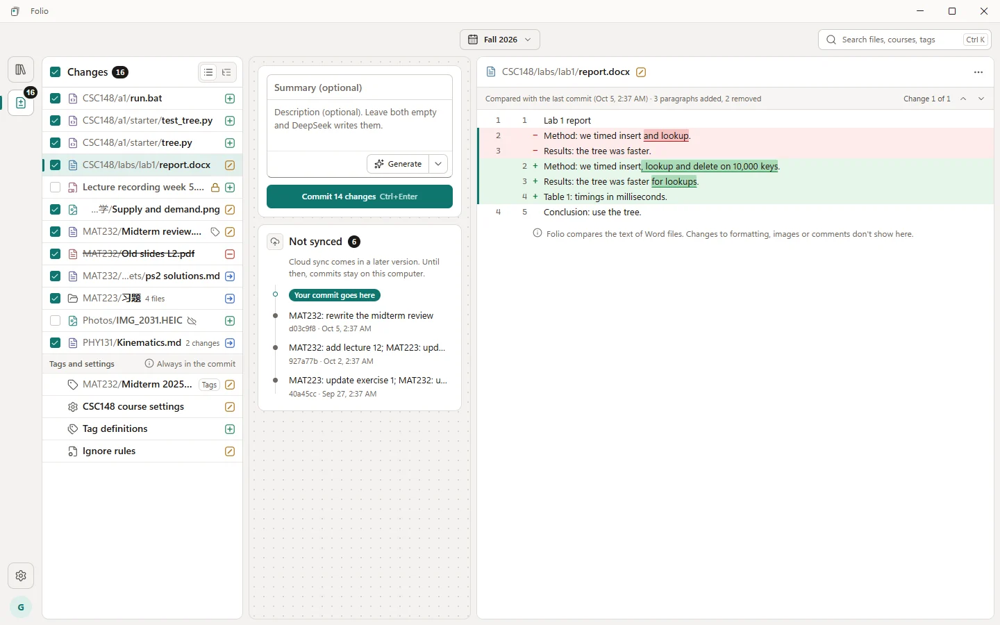
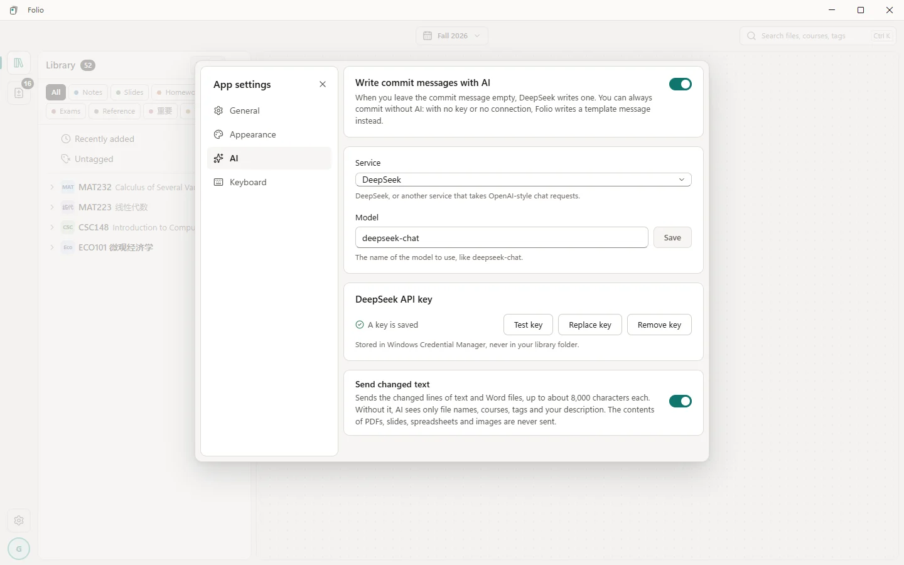
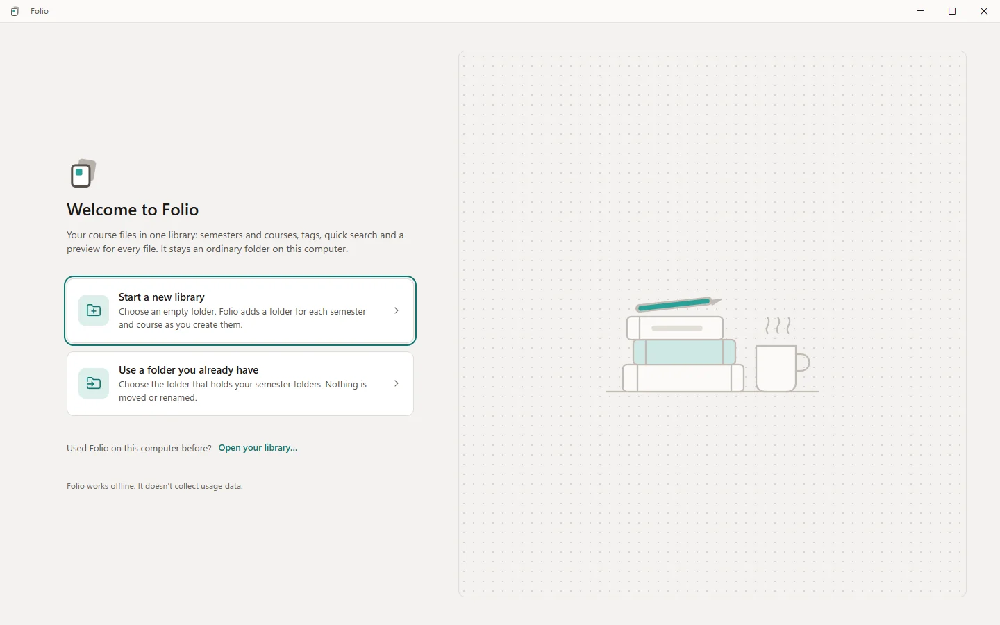
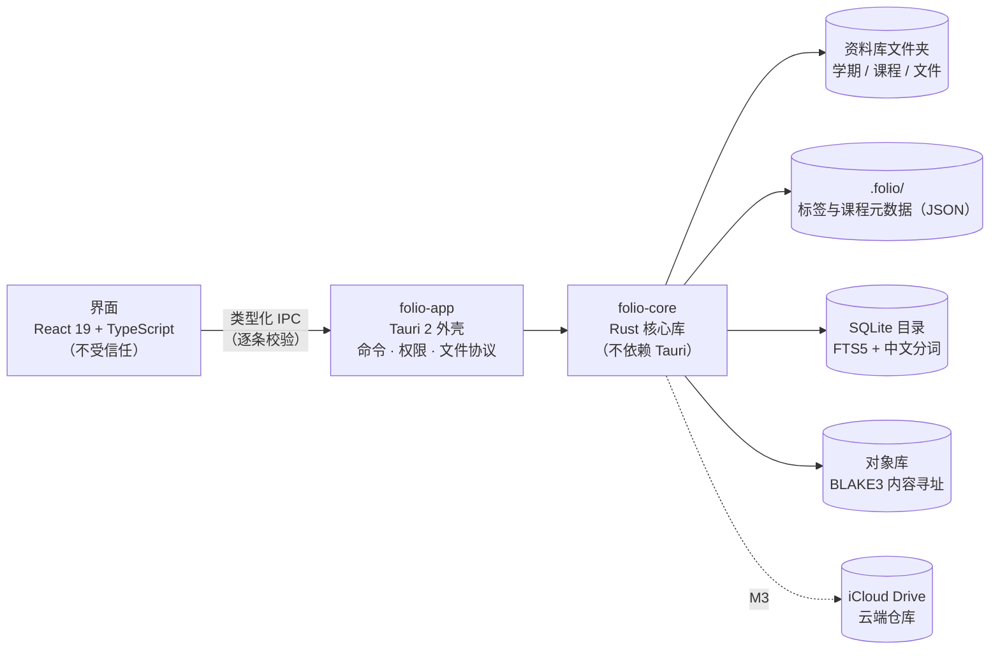

<h1 align="center">Folio</h1>

<p align="center">
  <b>给学生用的 Windows 桌面资料库</b><br>
  按「学期 → 课程」整理资料 · 多标签 · <code>Ctrl+K</code> 快速搜索 · 应用内预览 · 每次改动都有记录
</p>

<p align="center">
  <a href="https://github.com/siruimei07/Folio/actions/workflows/ci.yml"></a>
  
  
  
  
  
</p>

<picture>
  <source media="(prefers-color-scheme: dark)" srcset="docs/assets/readme/library-dark.webp">
  
</picture>

> [!NOTE]
> Folio 还在开发中，暂时没有安装包。本页截图来自开发版本，用的是内置的示例数据；界面目前只有英文，中文文件名和文件内容照常显示、照常能搜。

## Folio 是什么

Folio 把一个普通文件夹变成好用的资料库：第一级是学期，第二级是课程，文件可以贴上「笔记」「课件」「作业」等多个标签。它比资源管理器更直观，能直接预览 Markdown、代码、PDF 和 Office 文件；每一次改动都会被记录下来，文本和 Word 文件可以对比差异、找回旧版本，像一个「只有一条主线、对日常资料足够简单的 Git」。之后它还会把资料和历史同步到 iCloud Drive 里的一个文件夹，在 iPhone、iPad 上也能直接浏览。

它想解决的是这几件事：

| 问题 | Folio 的做法 |
|---|---|
| 按课程找文件要一层层点开，资源管理器没有标签 | 学期 → 课程的文件树，加可多选的标签筛选和 `Ctrl+K` 搜索 |
| 系统预览看不了渲染后的 Markdown 和高亮代码，PPT 预览依赖 Office | 应用内渲染预览，不依赖外部软件 |
| 网盘只同步「现在的样子」，看不出什么时候改了什么 | 每次提交都留下记录，历史随资料一起备份到云端 |
| Git 对日常资料太重 | 没有分支、没有命令行；文本和 Word 保存每个版本，其他文件只记录变动 |

**资料库始终是一个普通文件夹。** 离开 Folio，它依然是结构清楚的「学期 / 课程 / 文件」；Folio 自己的数据放在隐藏的 `.folio/` 文件夹里。

## 功能一览

### 资料库：学期、课程和标签

课程有颜色、缩写和课程编号；一个文件可以有多个标签，标签不改变文件在磁盘上的位置。选中标签，文件树里只留下带这个标签的文件，所在的课程和文件夹自动展开。在资源管理器或其他软件里对资料库的改动，Folio 会自动发现。

<picture>
  <source media="(prefers-color-scheme: dark)" srcset="docs/assets/readme/tags-dark.webp">
  
</picture>

### `Ctrl+K` 快速搜索

输入即出结果，方向键选择，回车预览。搜索文件名、路径、课程和标签，用自己写的分词器处理中文，中英文混排也能搜到；文本文件和 Word 文档的正文搜索随 M2 推出。

<picture>
  <source media="(prefers-color-scheme: dark)" srcset="docs/assets/readme/search-dark.webp">
  
</picture>

### 应用内预览

| 类型 | 预览方式 |
|---|---|
| Markdown | 渲染显示，支持数学公式和代码高亮（见页首截图） |
| 代码 / 纯文本 | 语法高亮、行号 |
| PDF | 翻页、缩放 |
| 图片、音频、视频 | 缩放 / 直接播放 |
| Word / Excel / PPT | 应用内渲染，不依赖 Office（M4） |

预览在一个没有网络、没有任何系统权限的沙箱 iframe 里进行，文件内容不会经过 IPC。第一版只预览、不编辑：双击用默认程序打开，保存后 Folio 自动发现改动。

### 改动与提交（M2，开发中）

「Changes」视图列出所有未提交的改动：新增、修改、删除、移动，以及标签和课程设置的改动。勾选要记录的改动，写一句说明（或者留空，让 Folio 按模板或用 AI 生成），按 `Ctrl+Enter` 提交。文本文件逐行对比，并标出行内具体改了哪些字。

<picture>
  <source media="(prefers-color-scheme: dark)" srcset="docs/assets/readme/changes-dark.webp">
  
</picture>

Word 文档对比的是文字内容（格式、图片和批注的改动不显示）。文本文件的每个版本都永久保留；Word 的旧版本按时间稀疏保留（30 天内全部保留，更早的每天或每周留一个）。恢复旧版本会产生一条新的改动，不改写历史。

<picture>
  <source media="(prefers-color-scheme: dark)" srcset="docs/assets/readme/worddiff-dark.webp">
  
</picture>

### AI 写提交说明（可选）

填入 DeepSeek（或其他兼容 OpenAI 格式的服务）的 API Key 后，提交说明留空时由 AI 撰写；不填 Key、或者没有网络，就用模板生成。Key 保存在 Windows 凭据管理器里，从不写进资料库。可以选择只发送文件名、课程和标签，不发送改动的正文；PDF、课件、表格和图片的内容永远不会发送。

<picture>
  <source media="(prefers-color-scheme: dark)" srcset="docs/assets/readme/settings-dark.webp">
  
</picture>

### 首次使用

新建一个空资料库，或者直接接管已经按学期 / 课程整理好的文件夹，不移动、不重命名任何文件。Folio 离线可用，不收集使用数据。

<picture>
  <source media="(prefers-color-scheme: dark)" srcset="docs/assets/readme/firstrun-dark.webp">
  
</picture>

## 进度

| 里程碑 | 内容 | 状态 |
|---|---|---|
| M0 | 工程底座：Tauri 2、类型化 IPC、CI、Playwright e2e | ✅ 2026-09-28 |
| M1 本地资料库（v0.1） | 浏览、标签、搜索、预览、导入、首次使用、设置 | ✅ 2026-10-03 |
| M2 版本记录（v0.2） | 提交、历史、文本和 Word 的差异与恢复、正文搜索、AI 提交说明 | 🔄 进行中 |
| M3 云端同步（v0.3） | iCloud 云端仓库、同步、冲突处理 | 🔒 未开始 |
| M4 打磨与分发（v1.0） | Office 预览、安装包、自动更新、首次使用引导 | 🔒 未开始 |

详细的路线图和规则见 [`docs/product/roadmap.md`](docs/product/roadmap.md)；每条开发分支的实时状态在 [`docs/roadmap/roadmap.json`](docs/roadmap/roadmap.json)。

## 技术架构



- **外壳与界面**：Tauri 2 + React 19 + TypeScript（[ADR-0001](docs/adr/ADR-0001-application-stack.md)）。界面层被当作不受信任的一方：文件系统、数据库和系统调用只在 Rust 一侧，通过一组窄而类型化的 IPC 命令暴露，每个窗口按命令单独授权，生产环境的 CSP 不允许内联脚本。
- **一份 IPC 合约**：请求和响应类型只在 Rust 里定义一次，TypeScript 绑定由 specta 自动生成（[ADR-0004](docs/adr/ADR-0004-ipc-contract.md)）。
- **数据**：同步的元数据是 `.folio/` 里的 JSON，本机的 SQLite 目录可以随时从文件夹重建，搜索用 FTS5 和自定义的中文分词器（[ADR-0002](docs/adr/ADR-0002-data-storage.md)）。
- **版本与同步**：自己设计的内容寻址存储（BLAKE3、不可变的打包文件），云端仓库里每台设备各写自己的记录，不依赖 iCloud 的文件锁（[ADR-0003](docs/adr/ADR-0003-versioning-and-sync.md)、[ADR-0006](docs/adr/ADR-0006-history-retention.md)）。
- **测试**：Rust 单元测试和属性测试、Vitest 组件测试，以及通过 WebView2 CDP 驱动真实应用的 Playwright 端到端测试；每次合并到 main 都在 GitHub Actions 的 Windows 机器上跑完整检查。

## 从源码构建

需要 Windows 10 / 11，以及：

- [Node.js](https://nodejs.org/) 24.19（见 `.nvmrc`）和 [pnpm](https://pnpm.io/) 11
- [Rust](https://rustup.rs/)（版本由 `rust-toolchain.toml` 固定，`rustup` 会自动安装）
- Visual Studio 2022 Build Tools（「使用 C++ 的桌面开发」，含 Windows SDK）
- WebView2 运行时（Windows 11 自带）

```bash
pnpm install
```

```bash
pnpm dev
```

`pnpm dev` 启动带热更新的桌面应用。其他常用命令：

| 命令 | 作用 |
|---|---|
| `pnpm --filter @folio/desktop dev` | 只启动界面，在浏览器打开 <http://localhost:5173>，用内置的示例数据代替真实的后端；加 `?scenario=large`、`?theme=dark` 等参数切换场景（列表见 `apps/desktop/src/ipc/mock/scenarios.ts`） |
| `pnpm check` | 类型检查、lint、Rust 格式和 clippy、全部单元测试 |
| `pnpm e2e` | 构建应用并运行 Playwright 端到端测试 |
| `pnpm bundle` | 打包 NSIS 安装包 |

## 仓库结构

```
crates/folio-core/   Rust 核心库：资料库、扫描、目录、搜索、对象库、版本记录
crates/folio-app/    Tauri 外壳：IPC 命令、权限、文件协议
apps/desktop/        React 界面（按视图分文件夹）和设计 token
e2e/                 Playwright 端到端测试
design/tokens/       设计 token 的源文件（浅色和深色）
docs/                产品简介、路线图、ADR、技术规格、设计交付文档
```

## 文档

- [产品简介](docs/product/brief.md)：做什么、为谁做、第一版做到哪里（中文）
- [路线图](docs/product/roadmap.md)：里程碑、分工和并行规则（中文）
- [架构决策（ADR）](docs/adr/)、[技术规格](docs/specs/)、[设计交付文档](docs/design/handoff/)（英文）
- [开发规范](CLAUDE.md)：分支、提交和检查的规则（英文）

## 许可证

暂未指定开源许可证。
