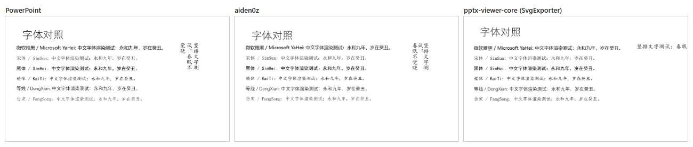
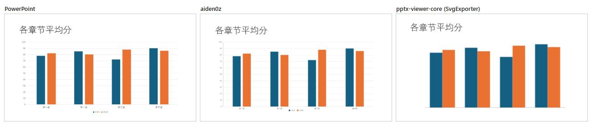
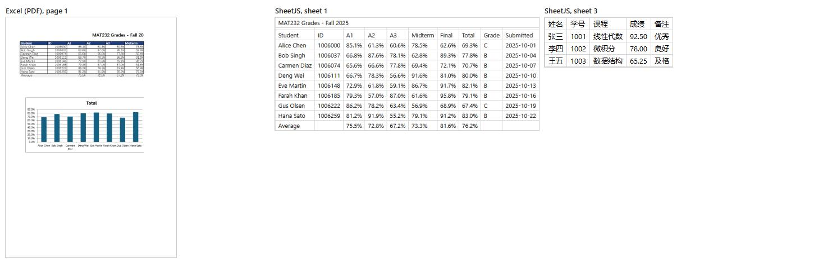

# Office 预览 spike：Word、Excel、PowerPoint 渲染器对比

- 日期：2026-09-28
- Lane：`spike/ui-office-preview`（ADR-0001 行动项 4c；brief §11 要求在 M1 期间做）
- 结论同时写进了 ADR-0001 行动项 4c（英文）。
- 试验代码放在仓库外，没有改动仓库的 lockfile 和 `node_modules`（见附录）。

## 结论

| 格式 | 推荐 | 效果 | 要注意的 |
|---|---|---|---|
| Word `.docx` | `docx-preview` 0.4.1 | 文字、表格、图片、页眉页脚都在，首屏不到 0.3 秒 | 不会真正分页（页数和 Word 不同，偶尔多一张空白页）；形状（截图上的红框）、图表不显示；个别段落间距丢失 |
| Excel `.xlsx` | SheetJS CE 0.20.3（从 SheetJS 自己的 CDN 安装，不用 npm 上的 0.18.5） | 数值、数字格式、日期、合并单元格、中文都对 | 没有单元格样式、列宽、图表（ADR 已接受）；2024-07 之后没有新版本 |
| PowerPoint `.pptx` | `@aiden0z/pptx-renderer` 1.3.0，加一张字体别名表 | 版式、文字、表格、图表、SmartArt、中文字体和竖排都好；两份中文 PPT 几乎和 PowerPoint 一样 | 四份英文课件里，两份有整份都受影响的模板问题（主题色错、白底缺失）；Office 云字体缺失（别名表能补上大部分）；少数页自动缩字过度 |
| 不推荐 | `pptx-viewer-core` | — | 本身没有渲染器，自带的 SVG 导出质量最差；配套的查看器是完整的编辑器（11 MB），在沙箱里直接报错，要打补丁，还会请求 Google Fonts；90 天发了 111 个版本 |

在 Folio 预览框的沙箱和 CSP 下，三个推荐的渲染器都**零 CSP 违规、零报错**，不需要放宽 CSP。

**降级方案**：每个 Office 预览都带「用默认程序打开」按钮；旧格式（`.doc`、`.ppt`）、加密文件、超大文件、渲染出错或超时，直接显示错误状态加「用默认程序打开」；M2 的正文抽取做好后，Word 再加「只看文字」（§8）。

**需要你决定**：PPT 预览做到什么程度（roadmap §6 的待定项），选项见 §8。我建议用 aiden0z 正常渲染，标注「预览可能与 PowerPoint 略有不同」，旁边放「用 PowerPoint 打开」。

## 1. 测试方法

### 文件

测试重心在英文课件（按你的要求）。课程文件夹里没有 `.xlsx`，也没有中文 PPT，所以另做了样例，中文课件用了 iCloud 里的一份。所有文件都是复制出来的副本，原文件只读取，没有用 Office 打开过。

| 文件 | 来源 | 大小 | Office 里的页数 | 测什么 |
|---|---|---|---|---|
| 一门课的课程大纲 `.docx` | 本机的课程文件夹 | 38 KB | 11 页 | 标题、表格、列表 |
| 一篇课程论文 `.docx` | 同上 | 20 KB | 5 页 | 长正文、行距、封面 |
| 图书馆检索练习（两份）`.docx` | 同上 | 547 KB、386 KB | 各 4 页 | 截图、标注框、表格、脚注 |
| Week 1 / 4 / 10 / 5 课件 `.pptx` | 同上 | 1 MB / 4 MB / 4 MB / 43 MB | 14 / 29 / 34 / 37 页 | 四种模板、图片、SVG 图标、43 MB 大文件 |
| 新闻各类型要点 `.pptx` | iCloud 里的真实中文课件 | 1.4 MB | 12 页 | 中文排版、思维导图 |
| 中文样例 `.pptx` | 用 PowerPoint 自制 | 64 KB | 7 页 | 6 种中文字体、竖排、表格、图表、SmartArt、中英混排 |
| 工作簿样例 `.xlsx` | 用 Excel 自制 | 17 KB | 3 张表 | 百分比、日期、货币格式、合并单元格、公式、条件格式、图表、冻结窗格、中文表 |

### 环境和沙箱

- 浏览器：Microsoft Edge 154（headless，由 Playwright 驱动）。Folio 用的 WebView2 在本机是 153，同一个 Chromium 内核。
- 机器：Intel Core Ultra 9 275HX，32 GB 内存。普通笔记本会慢一些。
- 沙箱和 Folio 的预览框一致：
  - `<iframe sandbox="allow-scripts">`，和主窗口不同 origin；
  - 同一条 CSP（`crates/folio-app/src/preview.rs`）：只运行自己的脚本，没有 `eval`，没有内联脚本，没有网络请求；
  - 删掉 `RTCPeerConnection`；
  - 每个文件一个新的 frame，主窗口用 `postMessage` 把文件字节交给 frame。
- 每个渲染器单独打包（esbuild 压缩后的 ESM，和生产构建相当）。
- 所有包都至少发布了一天：pnpm 的 `minimumReleaseAge` 设为 1440 分钟；SheetJS 的 tarball 是 2024-07 的。

### 指标

- **对照**：Office 自己导出的 PDF。PPT 另外用 PowerPoint 导出每页 1280×720 的 PNG，做逐页对比。
- **首屏时间**：从创建 frame 到第一页或第一张幻灯片画出来，包括加载和解析渲染器脚本。每个文件测 3 次：第 1 次在全新的浏览器上下文里（冷启动），后 2 次取中位数（热启动）。
- **保真度**：Word 和 Excel 对照 PDF 目测。PPT 另外逐页算 SSIM（结构相似度，1 表示完全相同）：
  - 字体抗锯齿之类的细小差别也会扣分，看起来一样的页一般在 0.8 以上；
  - 低于 0.5 基本是背景、字体或版式明显不对；
  - 按灰度计算，对颜色错误不敏感：Week 1 的横幅画成红色，整份仍有 0.87；
  - 所以 SSIM 只用来比较渲染器之间的相对好坏，颜色问题靠目测。
- **包体积**：压缩后的 JS，以及 gzip 后的大小。
- **许可证和维护**：npm registry、GitHub、git.sheetjs.com 上的数据（2026-09-28）。

## 2. 总表

| | docx-preview | SheetJS CE | aiden0z | pptx-viewer-core（SVG 导出） | pptx-vanilla-viewer |
|---|---|---|---|---|---|
| 版本 | 0.4.1 | 0.20.3 | 1.3.0 | 4.7.2 | 3.12.0 |
| JS 体积（压缩后 / gzip） | 173 KB / 51 KB | 365 KB / 123 KB | 1,220 KB / 380 KB | 3,046 KB / 849 KB | 11,101 KB / 3,027 KB，另有 161 KB CSS |
| 首屏，冷启动 | 72–278 ms | 66 ms | 239–420 ms | 306–753 ms | 原样无法运行；打补丁后 718–1,021 ms |
| 首屏，热启动 | 41–50 ms | 39 ms | 78–269 ms | 173–533 ms | 332–645 ms |
| JS 内存 | 3–4 MB | 4 MB | 8–50 MB | 16–72 MB | 41–126 MB |
| CSP 违规 / 报错 | 0 / 0 | 0 / 0 | 0 / 0 | 0 / 0 | 原样读 `localStorage` 就报错；打补丁后仍有 2 处 `eval` 被拦，还请求 Google Fonts |
| PPT 平均 SSIM（英文 / 中文） | — | — | 0.68 / 0.84；加字体别名 0.71 / 0.84 | 0.57 / 0.75 | 0.67 / 0.88 |
| SSIM ≥ 0.8 的页（共 133 页） | — | — | 45；加字体别名 53 | 6 | 42 |
| SSIM < 0.5 的页 | — | — | 16；加字体别名 14 | 31 | 17 |
| 许可证 | Apache-2.0 | Apache-2.0 | Apache-2.0 | Apache-2.0 | Apache-2.0 |

43 MB 的 Week 5 课件：aiden0z 冷启动 420 ms 出第一页，内存 50 MB。它只解析和渲染看得见的几页（`lazyMedia`、`lazySlides`、窗口化列表），所以文件大小对首屏影响不大。

## 3. PowerPoint

### 3.1 `@aiden0z/pptx-renderer`（推荐）

**做得好的**：

- 版式、文字、项目符号、表格、图表（用 ECharts 画）、SmartArt、中文字体、竖排、中英混排都好。
- 两份中文 PPT 几乎和 PowerPoint 一样（下面两张图是自制样例；真实中文课件那张截图含第三方内容，仓库公开后只留在本机）。
- 解压有安全上限（`RECOMMENDED_ZIP_LIMITS`），大文件只解析看得见的页。

**问题**（主要出在英文课件的模板上）：

1. **Office 云字体**。
   - 新版 Office 模板常用 Aptos、Avenir Next LT Pro、Speak Pro、Selawik、Sabon Next、Abadi、Source Sans Pro 等字体。它们是 Office 自己下载的「云字体」，没有装进 Windows，所以 PowerPoint 能用，浏览器用不到。这几份课件里用了很多。
   - aiden0z 找不到字体时会退回衬线体，甚至等宽字体。
   - 补救：在预览页的样式表里用 `@font-face { src: local("Segoe UI") }` 把这些字体名映射到系统里有的字体（字体别名表）。这不走网络，现有 CSP 允许。英文页的平均 SSIM 从 0.68 升到 0.71，≥ 0.8 的页从 31 页升到 39 页。
   - 不能直接拿 Office 缓存里的云字体文件来用：它们只授权给 Office。
2. **图片重新着色（duotone）不支持**。Week 1 的模板把一张图片重新着色成蓝色横幅，aiden0z 忽略了着色，画成原图的红色，整份课件每一页都这样。
3. **个别模板的背景形状缺失**。Week 4 的模板内容区应该是白底，aiden0z 画成了蓝底。
4. **自动缩字（normAutofit）**。少数页的标题被缩得太小，正文溢出文本框。

（原来这里有 Week 1 / 10 / 4 / 5 四张对比截图：横幅颜色、云字体退回衬线体、白色内容区缺失、标题缩得太小。它们是真实课件的渲染，含第三方版权内容，仓库公开后只留在本机。）

问题 2 和「缺字体时退回衬线体」可以报给上游。aiden0z 的维护者一般几天内回复 issue。

### 3.2 `pptx-viewer-core`（不推荐）

- 它是解析、编辑、保存 `.pptx` 的引擎，本身没有界面。唯一不依赖框架的渲染方式是 `SvgExporter`，效果最差：
  - 文字基本不换行，一段话挤成一行后被截断；
  - 背景和模板图形缺失，竖排变成横排；
  - 图表没有坐标轴和图例，SmartArt 的箭头变成方块；
  - 133 页里只有 6 页 SSIM ≥ 0.8。
- 真正的渲染在同一作者的 `pptx-vanilla-viewer` 和 `pptx-react-viewer` 里，它们是完整的 PowerPoint 式编辑器：
  - 原样放进沙箱就报错：启动时读 `localStorage`，沙箱的 opaque origin 下会抛 SecurityError；
  - 我用内存版 `localStorage` 打了补丁，之后能渲染。保真度和 aiden0z 相当（英文 0.67，中文 0.88），主题着色和缺字体的处理比 aiden0z 好；
  - 但仍有 2 处 `eval` 被 CSP 拦下，还会向 `fonts.googleapis.com` 请求替代字体。CSP 拦住了请求，但这说明它默认会把文档用到的字体名发到外网；
  - 包体积 11 MB（gzip 后 3 MB），带着 jsPDF、html2canvas、AI 助手、Yjs 协作、MCP server SDK 等依赖，共 137 个传递依赖；React 版还要求 framer-motion、i18next 等 10 个 peer 依赖。
- 维护：2026-03 首次发布，90 天内发了 111 个版本（React 版 192 个），主要是一个人加 AI 在写。按我们「依赖至少发布一天」的规则很难跟上，也很难审查。

## 4. Word：`docx-preview`

- 文字、标题、列表、表格、图片、页眉页脚、脚注、超链接都在，首屏不到 0.3 秒。
- **不会真正分页**。它只在显式分页符、Word 保存的「上次分页位置」和分节处断页，所以页码和 Word 对不上：
  - 课程大纲在 Word 里 11 页，这里 8 页；
  - 你的论文 5 页，这里 6 页，其中第 2 页是空白页。
  - 每页内的内容是连续的，读起来影响不大。
- **形状不显示**：练习表截图上的红色标注框没了。图表、SmartArt、EMF/WMF 图片也不支持（和 ADR 里写的一致）。
- 个别段落间距丢失：论文封面的行距被压紧了。
- 只用主题字体的文字会退回衬线体，同样可以用字体别名表补。
- 安全：要设 `renderAltChunks: false`，否则它会把文档里嵌的 HTML 放进 `<iframe srcdoc>`。

（原来这里有两张对比截图：课程大纲第 2 页表格和列表一致、分页位置不同；检索练习截图上的红色标注框缺失、一段文字退回衬线体。它们是真实课程资料的渲染，仓库公开后只留在本机。）

## 5. Excel：SheetJS CE

- 数值、百分比、日期、合并单元格、公式结果（读 Excel 保存的计算值）、中文都对；多张工作表可以切换。
- 没有单元格底色、粗体、边框、列宽、条件格式、图表、冻结窗格。ADR-0001 已接受这一点（2026-09-26）。
- **不要用 npm 上的 `xlsx`**：它停在 0.18.5，有两个高危漏洞（原型污染 CVE-2023-30533、ReDoS CVE-2024-22363），修复只在 SheetJS 自己的 CDN 版本里。要从 `https://cdn.sheetjs.com/xlsx-0.20.3/xlsx-0.20.3.tgz` 安装并固定版本。
- `sheet_to_html` 过滤链接的功能还没发布。实现时用单元格数据自己建表格 DOM，或者先过一遍 sanitizer。
- 没测大表：样例只有十几行。实现时要做虚拟滚动或限制行数。

## 6. 许可证和维护

| | 许可证 | 首次发布 | 最近发布 | 90 天内版本数 | GitHub stars | 维护情况 |
|---|---|---|---|---|---|---|
| docx-preview | Apache-2.0；依赖 jszip（MIT 或 GPL-3.0 双许可，选 MIT） | 2018-03 | 2026-09-21 | 2 | 2.1k | 一个人为主；近 12 个月约一半 issue 没人回复 |
| SheetJS CE | Apache-2.0，没有依赖 | 2013-12 | 2024-07-18 | 0 | 36k | 公司维护，发版很慢 |
| aiden0z | Apache-2.0；打包了 ECharts（Apache-2.0）和 mtx-decompressor（MPL-2.0） | 2026-02 | 2026-09-14 | 3 | 123 | 一个人为主，issue 几天内回复 |
| pptx-viewer-core | Apache-2.0，要保留 NOTICE；同样含 mtx-decompressor（MPL-2.0） | 2026-03 | 2026-09-26 | 111 | 109 | 一个人加 AI，发版极频繁 |

- 所有依赖树里都没有 GPL-only 或 AGPL 的包。
- MPL-2.0 是文件级的 copyleft：原样打包、附上许可证声明就可以。
- 三个推荐的项目都靠一个人或一家公司维护，所以版本要固定，升级走依赖 lane。

## 7. 沙箱和 CSP

- docx-preview、SheetJS、aiden0z 在 Folio 预览 CSP 下零违规，不需要改 CSP。
- 每个渲染器各有一处设置要固定：
  - aiden0z 设 `pdfjs: false`：它用 PDF.js 画 EMF 预览图时要开 blob Worker，这在我们的 CSP 下不允许；普通页面不受影响；
  - docx-preview 设 `renderAltChunks: false`；
  - SheetJS 自己建表格 DOM。
- 字体别名表用 `local()`，不走网络。
- pptx-viewer 系列需要放宽 CSP 或打补丁，不符合预览沙箱的原则。

## 8. 降级方案，以及 PPT 做到什么程度

降级（三种格式都适用）：

1. 预览头部始终有「用默认程序打开」按钮。它由主窗口通过 `tauri-plugin-opener` 执行，不经过预览 frame。
2. 以下情况不渲染，直接显示错误状态和「用默认程序打开」：
   - 旧格式 `.doc`、`.ppt`（这两个渲染器只读新格式；SheetJS 能读 `.xls`）；
   - 加密文件；
   - 超过大小上限（建议 100 MB）；
   - 渲染报错，或 10 秒内没出第一页。
   - 文案按 CLAUDE.md 用 `design:ux-copy` 写。
3. 「只看文字」：M2 的 `feat/core-text-extract` 会从 `.docx` 抽正文，之后 Word 渲染失败时可以显示纯文字。PPT 的文字抽取在 system overview 里排在后面。

PPT 预览做到什么程度，请你选：

| 选项 | 做法 | 优点 | 缺点 |
|---|---|---|---|
| A（建议） | aiden0z 渲染，加字体别名表，提示「预览可能与 PowerPoint 略有不同」，旁边放「用 PowerPoint 打开」 | 不装 Office 也能看，中文课件几乎一致 | 部分英文模板的颜色、背景、字体和 PowerPoint 不同 |
| B | 只显示第一页做封面，看完整内容用默认程序打开 | 差异不显眼 | 看不到其他页，价值低 |
| C | 不渲染，只有「用默认程序打开」 | 最简单 | brief 里「不依赖外部软件」的预览就没有了 |

## 9. 给后续 `feat/ui-office-preview` 的实现要点

- 三个渲染器在预览页里按格式用 `import()` 按需加载。aiden0z 的 380 KB（gzip）里 ECharts 占了一半多。
- 在 `apps/desktop/src/preview/protocol.ts` 里扩展消息类型（docx、xlsx、pptx）。
- aiden0z 的参数：`zipLimits: RECOMMENDED_ZIP_LIMITS`、`pdfjs: false`、`lazyMedia`、`lazySlides`、`listOptions: { windowed: true }`、`scrollContainer`。
- 字体别名表放在预览页的样式表里，docx 和 pptx 共用。本次用的映射：无衬线的云字体 → Segoe UI，Sabon Next → Cambria。
- 固定版本：docx-preview、jszip（docx-preview 声明的范围是 `>=3.0.0`）、aiden0z、SheetJS 的 tarball。
- 安装包里附第三方许可证声明（NOTICE、MPL-2.0）。
- 测试：用自己生成的小 `.docx`、`.xlsx`、`.pptx`，在预览沙箱里做 Playwright e2e，检查渲染成功、没有 CSP 违规。真实课件不进仓库（testing-strategy）。

## 10. 局限

- 在 Edge 154 上测的，不是 Folio 里的 WebView2 153。内核相同，差别应该很小。
- 只测了一台很快的机器。
- 英文课件都来自同一门课，只有四种模板。
- Excel 只有一份自制样例，没有真实的大表。
- Word 文件里没有图表、SmartArt、公式；没有测中文 Word 文档。
- SSIM 只算了 PPT，Word 页数对不上，没法逐页算。

## 附录：试验代码

- 代码在 session 的 scratchpad 里，另复制了一份到仓库外的 `../folio-agent-work/tasks/spike-ui-office-preview/`（只有脚本和结果 JSON，没有课程文件）。
- 文件：
  - `server.mjs`：两个 origin，frame 带 Folio 的 CSP；
  - `src/`：每个渲染器的 frame 入口；
  - `build.mjs`：打包、体积、静态检查；
  - `run.mjs`：计时、截图、SSIM；
  - `compose.mjs`：拼对比图；
  - `export-one.ps1`：用 Office 导出对照 PDF 和 PNG。
- 用 Office 自动导出 PDF 时遇到的坑：
  - Word 和 Excel 需要 Print Spooler 服务在运行；
  - Word 以只读方式打开、或者从很深的路径打开时，导出会卡住。
